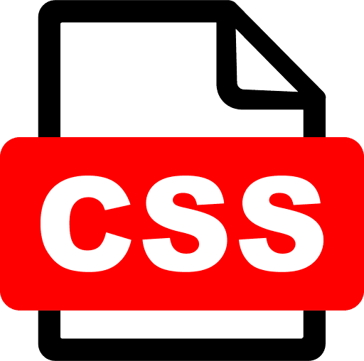

# G Linski

## About Me:
 
  Hey I'm Gabe. A programmer from Canada. Currently working through a program at MITT to improve my skills.
  Once I'm a little more through the course, I'll actually have stuff to add to this page.
  Right now I'm not too shabby at HTML, Python, JavaScript and CSS.
  In the near future I'd like to learn about database management and app development.

## Skills
  
  
  
  
  

## Non-Tech Interests
  - Ultimate Frisbee
  - Board Games
  - Brewing Beer
  - Volleyball

## Projects
  - One Day this will be filled

## Achievements
| Badge | Description |
| ----------- | ----------- |
| Header | Title |
| Paragraph | Text |

## The Stats Portion

